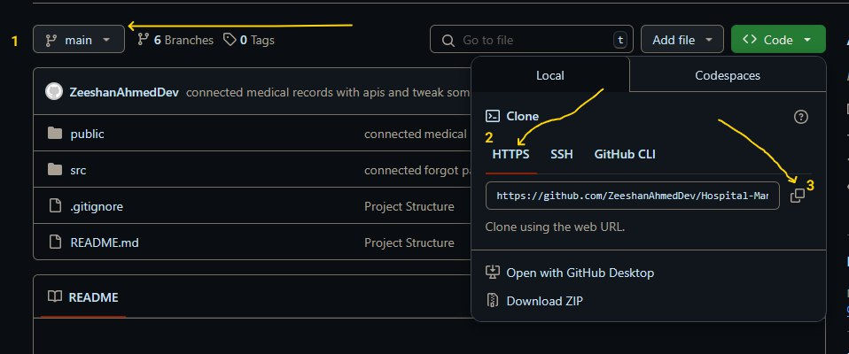
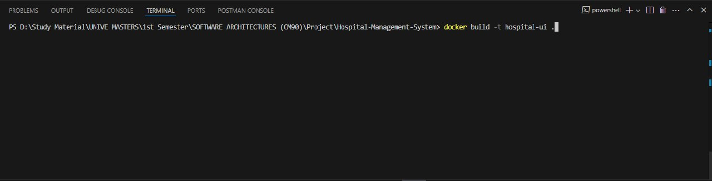
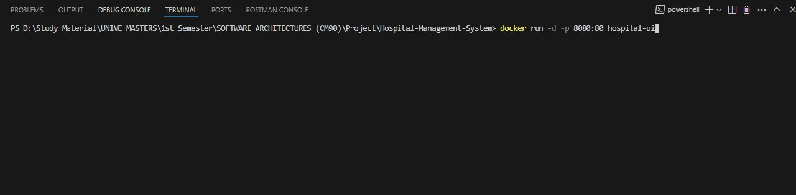
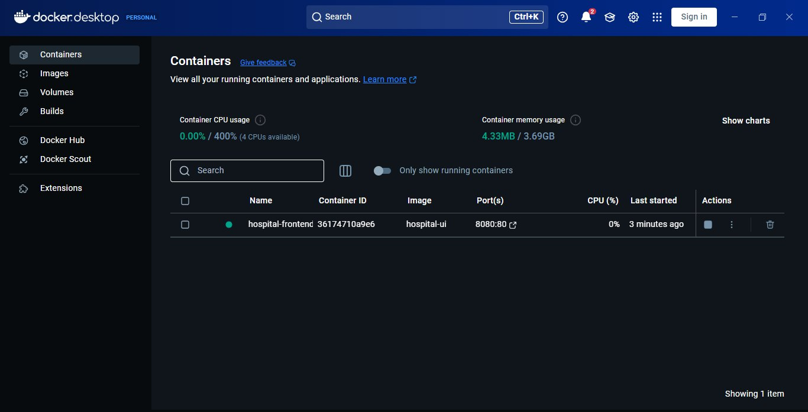

# Hospital Management System — Frontend Project

This is the **frontend** of the Hospital Management System which is built with **HTML**, **CSS (Bootstrap)**, and **JavaScript**.  
It is designed to provide an interactive and responsive interface for patients and staff to manage appointments, profiles, and hospital services. It's an eye-catching UI with different color combinations. 


## Features

- **User Authentication**
  - Login / Register (Patients & Staff)
  - Forgot Password (Email-based reset)
  
- **Appointment Management**
  - Book, edit, or cancel appointments
  - View appointment history (for both patients & staff)

- **Patient & Staff Dashboards**
  - View and update profiles
  - Manage wards and schedules (It's only for staff)
  - Medical record access (for patients)

- **Responsive UI**
  - Built using **Bootstrap 5** for a clean, mobile-first design, which supports the Responsive UI design principle to provide a better experience. 

- **API Integration**
  - It is connected to the backend via REST APIs (Node.js - Express + MongoDB)


## Getting Started

### 1. Clone the repository

```bash
git https://github.com/ZeeshanAhmedDev/Hospital-Management-System.git
cd hospital-management-system
```

### 2. Serve the frontend

 Build it with Docker, and open the terminal in the root folder. Run the following commands.

```bash
docker build -t hospital-ui .
docker run -d -p 8080:80 --name hospital-frontend hospital-ui
```

Then open [http://localhost:8080](http://localhost:8080) in your browser. You will the see the Front-End of the Hospital Management System on the **8080** port. You will also see the dedicated ports in the docker application you can also open this from there. 


## Environment Configuration

Make sure that the Hospital Management System Backend APIs are also dockerized in the defined way. Head over to the backend for the configuration. 

Backend source code (Node.js + Express + MongoDB) available here:  
 [GitHub - Backend Hospital-Management-System](https://github.com/ZeeshanAhmedDev/Backend-Hospital-Management-System.git)


## Follow ScreenShots. If you still have not gotten the description

### Step 01: Clone the repo


### Step 02: Enter First Command in the terminal


### Step 03: Enter Second Command in the terminal


### Step 04: You will see the port running in Docker



Following the dedicated steps you will get the desired mentioned output.

Thank you